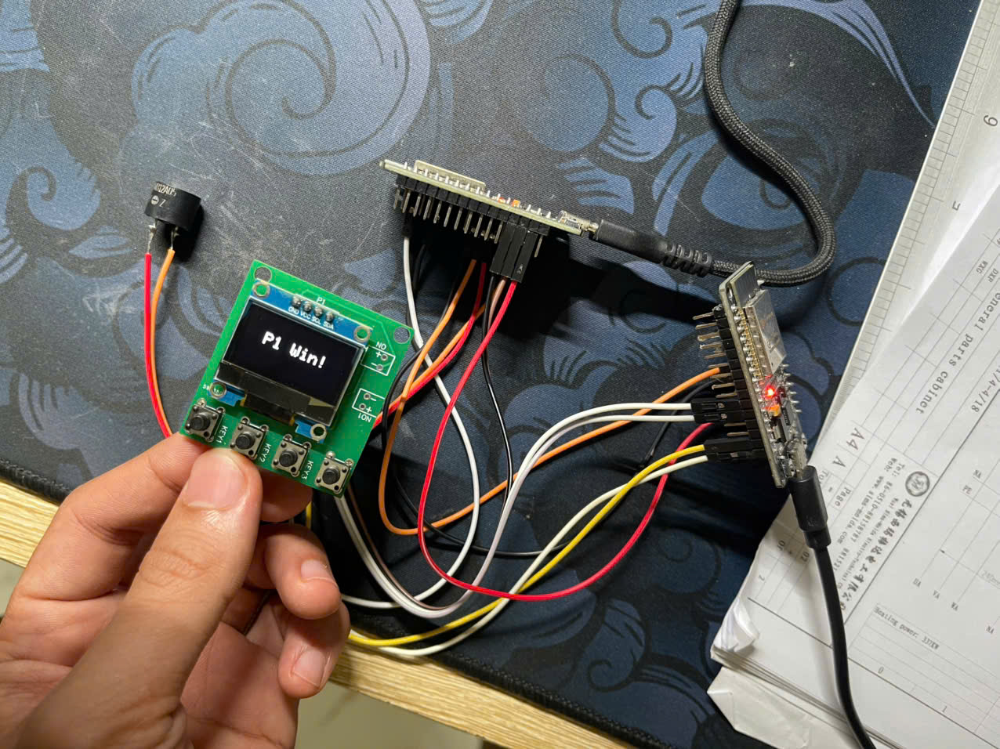
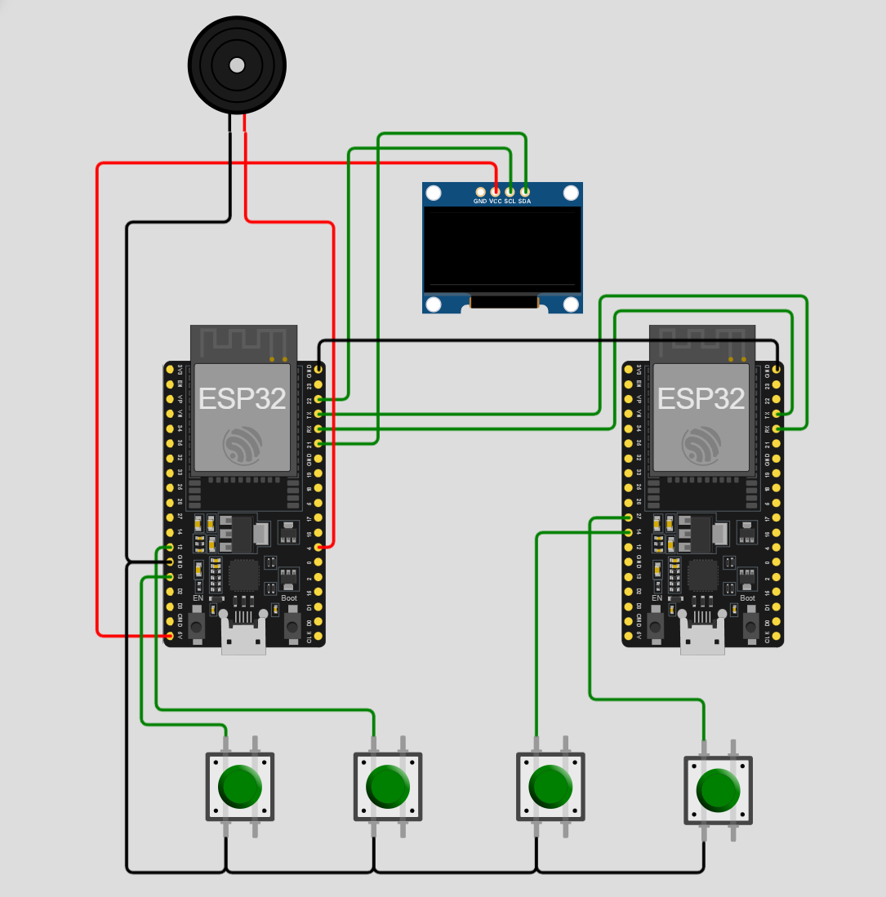

# BÁO CÁO HỆ NHÚNG

Game Pingpong

## GIỚI THIỆU

- **Đề bài:** Thiết kế và xây dựng hệ thống trò chơi Ping Pong cho 2 người chơi trên nền tảng vi điều khiển ESP32 DevKit V1.
- **Tính năng yêu cầu:**
  - 2 board nối với nhau qua UART cho 2 người 2 bên.
  - Mỗi người chơi điều khiển một vợt thông qua 2 nút nhấn riêng biệt.
  - Hiển thị trạng thái trò chơi (vị trí bóng, vị trí vợt, hướng bóng, điểm số) lên màn hình OLED.
  - Xử lý va chạm bóng với vợt, tường và cập nhật điểm số.
  - Cho phép bắt đầu/trò chơi lại khi có tín hiệu điều khiển.
  - Đảm bảo tốc độ xử lý mượt mà, không giật lag khi thao tác điều khiển.
  - Hiệu ứng âm thanh (buzzer) khi có điểm.
- **Ý nghĩa:** Dự án giúp sinh viên rèn luyện kỹ năng lập trình nhúng, xử lý ngoại vi (GPIO, giao tiếp màn hình, UART...), thiết kế giao diện điều khiển thực tế, và làm việc nhóm.

- Ảnh chụp minh họa:

  

## TÁC GIẢ

- Tên nhóm: T&B
- Thành viên trong nhóm
  |STT|Họ tên|MSSV|Công việc|
  |--:|--|--|--|
  |1|Lê Đình Thông|20215648|hiện thị oled, hiệu ứng, và nút nhấn|
  |2|Trần Xuân Bách|20215528|Vẽ sơ đồ Schematic và viết báo cáo|

## MÔI TRƯỜNG HOẠT ĐỘNG

- **Module CPU / Dev kit sử dụng:**  
  - ESP32 DevKit V1/ Arduino IDE

- **Các kit, module, linh kiện sử dụng:**
  - 2 module ESP32 DevKit V1
  - 4 nút nhấn
  - Màn hình oled 0.96 ich SSD1306
  - Buzzer
  - Dây kết nối Dupont

- **Chức năng từng module:**
  - **ESP32 Master:** Xử lý tín hiệu, đọc dữ liệu nút nhấn, điều khiển logic game ping pong hai người chơi, điều khiển màn hình và buzzer.
  - **ESP32 Slave:** Xử lý tín hiệu, đọc dữ liệu nút nhấn, điều khiển logic game ping pong hai người chơi.
  - **Buzzer:** Kêu khi người chơi ghi điểm.
  - **SSD1306:** Hiển thị giao diện trò chơi.

## SƠ ĐỒ SCHEMATIC

### TÍCH HỢP HỆ THỐNG

#### **Thành phần phần cứng và vai trò**
  - **ESP32 Master:** Xử lý tín hiệu, đọc dữ liệu nút nhấn, điều khiển logic game ping pong hai người chơi, điều khiển màn hình và buzzer.
  - **ESP32 Slave:** Xử lý tín hiệu, đọc dữ liệu nút nhấn, điều khiển logic game ping pong hai người chơi.
  - **Buzzer:** Kêu khi người chơi ghi điểm.
  - **SSD1306:** Hiển thị giao diện trò chơi.

#### **Thành phần phần mềm và vai trò**
- **Firmware(chạy trên ESP32)**: 
  - Nhận và xử lý tín hiệu analog từ các nút nhấn.
  - Thực hiện thuật toán di chuyển bóng, phát hiện va chạm, cập nhật điểm số.
  - Điều khiển giao diện hiển thị OLED.
  - Xử lý các hiệu ứng phụ như âm thanh.
- **Giao diện người dùng**:  
  - Được hiển thị trực tiếp trên màn hình nối với ESP32.
  - Không sử dụng phần mềm ngoài, mọi thao tác điều khiển và hiển thị được thực hiện toàn bộ trên vi điều khiển và các module ngoại vi.

#### **Lưu ý**
- Hệ thống hoạt động hoàn toàn **độc lập, không cần kết nối mạng, không có máy chủ** hay các thành phần IoT phức tạp.
- Tất cả các chức năng từ nhập liệu, xử lý đến hiển thị đều nằm trên **ESP32 DevKit V1** và các module ngoại vi kèm theo.

### ĐẶC TẢ HÀM

- Giải thích một số hàm quan trọng: ý nghĩa của hàm, tham số vào, ra

hàm vòng lặp xử lý trò chơi 
{
    
    void loop() {
    if (!gameStarted) {
        if (!digitalRead(P1_UP) || !digitalRead(P1_DOWN) || Serial2.available()) {
        gameStarted = true;
        resetGame();
        }
        return;
    }

    if (waitingForRestart) {
        if (!digitalRead(P1_UP) || !digitalRead(P1_DOWN) || Serial2.available()) {
        waitingForRestart = false;
        resetGame();
        }
        return;
    }

    // Điều khiển Player 1
    if (!digitalRead(P1_UP)) paddle1Y -= 2;
    if (!digitalRead(P1_DOWN)) paddle1Y += 2;
    paddle1Y = constrain(paddle1Y, 0, SCREEN_HEIGHT - 16);

    // Điều khiển Player 2
    if (Serial2.available()) {
        String cmd = Serial2.readStringUntil('\n');
        cmd.trim();
        if (cmd == "UP") paddle2Y -= 2;
        else if (cmd == "DOWN") paddle2Y += 2;
        paddle2Y = constrain(paddle2Y, 0, SCREEN_HEIGHT - 16);
    }

    if (!gameOver) {
        // Cập nhật bóng
        ballX += ballDX;
        ballY += ballDY;

        if (ballY <= 0 || ballY >= SCREEN_HEIGHT) ballDY *= -1;

        if (ballX <= 6 && ballY >= paddle1Y && ballY <= paddle1Y + 16) ballDX *= -1;
        if (ballX >= 122 && ballY >= paddle2Y && ballY <= paddle2Y + 16) ballDX *= -1;

        if (ballX <= 0) {
        scoreP2++;
        endGame(2);
        } else if (ballX >= SCREEN_WIDTH) {
        scoreP1++;
        endGame(1);
        }
    }

    drawGame();
    delay(30);
    }
}

### KẾT QUẢ

- Các ảnh chụp với caption giải thích.
- Hoặc video sản phẩm